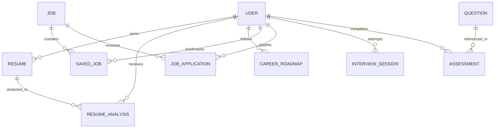

# CareerPilot AI – Database Schema & Data Models Documentation

This document describes the 10 Mongoose models used in the CareerPilot AI application, their fields, types, constraints, relationships, and indexing strategies.

---

### Entity Relationship Overview

---

### 1. `User` Model (`users` collection)
Stores authentication credentials, user role, and personal/academic profile details.

| Field | Type | Attributes | Description |
| :--- | :--- | :--- | :--- |
| `_id` | ObjectId | Primary Key | Unique user identifier |
| `name` | String | required, trim, min: 2 | Full name of the user |
| `email` | String | required, unique, lowercase, index | Unique login email address |
| `password` | String | required, select: false | Bcrypt hashed password |
| `role` | String | enum: `['student', 'admin']`, default: `'student'` | Role for RBAC access control |
| `targetRole` | String | default: `'MERN Stack Developer'` | Target job role for roadmaps & interviews |
| `skills` | [String] | default: `[]` | List of candidate's skills used in matching |
| `profile` | Object | Embedded document | Contains college, degree, branch, graduationYear, cgpa, phone, bio, location, githubUrl, linkedinUrl, portfolioUrl |
| `profileCompletion` | Number | min: 0, max: 100, default: 20 | Dynamically computed percentage of filled fields |
| `isActive` | Boolean | default: `true`, index | Account active / suspended toggle |
| `resetPasswordToken` | String | select: false | SHA-256 hash for password resets |
| `resetPasswordExpire` | Date | select: false | Expiration timestamp for reset token |
| `createdAt` / `updatedAt` | Date | timestamps | Automatic audit timestamps |

---

### 2. `Resume` Model (`resumes` collection)
Stores metadata and parsed text from student resume uploads.

| Field | Type | Attributes | Description |
| :--- | :--- | :--- | :--- |
| `_id` | ObjectId | Primary Key | Unique resume record ID |
| `userId` | ObjectId | ref: `User`, required, index | Student who uploaded the resume |
| `fileName` | String | required | Original name of uploaded file |
| `fileUrl` | String | required | Path in server `/uploads` directory |
| `fileType` | String | enum: `['application/pdf', 'application/vnd.openxmlformats-officedocument.wordprocessingml.document']` | Mime type |
| `fileSize` | Number | required | File size in bytes |
| `extractedText` | String | default: `''` | Plain text extracted via `pdf-parse` or `mammoth` |
| `isDefault` | Boolean | default: `false` | Whether this is the active default resume |

---

### 3. `ResumeAnalysis` Model (`resumeanalyses` collection)
Persists Gemini ATS analysis results, category breakdowns, and skill gap matrices.

| Field | Type | Attributes | Description |
| :--- | :--- | :--- | :--- |
| `userId` | ObjectId | ref: `User`, required, index | Student owner |
| `resumeId` | ObjectId | ref: `Resume`, required, index | Analyzed resume |
| `targetRole` | String | required, index | Role against which ATS evaluation was done |
| `atsScore` | Number | min: 0, max: 100, required | Composite ATS compatibility score |
| `categoryScores` | Object | `{ formatting, keywords, experience, skills }` | Scores out of 100 per category |
| `matchingSkills` | [String] | default: `[]` | Skills found in both resume and role standard |
| `missingSkills` | [String] | default: `[]` | Skills missing from resume for target role |
| `strengths` | [String] | default: `[]` | Positive observations |
| `weaknesses` | [String] | default: `[]` | Critical areas needing enhancement |
| `actionableRecommendations` | [String] | default: `[]` | Concrete phrasing and formatting steps |
| `suggestedProjects` | [String] | default: `[]` | Projects to build to prove missing competencies |

---

### 4. `CareerRoadmap` Model (`careerroadmaps` collection)
Stores structured step-by-step career milestones and student progress.

| Field | Type | Attributes | Description |
| :--- | :--- | :--- | :--- |
| `userId` | ObjectId | ref: `User`, required, index | Student follower |
| `role` | String | required, index | Target engineering position |
| `milestones` | [Object] | Array of subdocuments | Contains `title`, `description`, `topics`, `resources`, `isCompleted`, `completedAt` |
| `recommendedProjects`| [Object] | Array of subdocuments | Contains `title`, `description`, `techStack`, `difficulty` |
| `overallProgress` | Number | min: 0, max: 100, default: 0 | Ratio of completed milestones |

---

### 5. `Job` Model (`jobs` collection)
Stores placement and internship opportunities.

| Field | Type | Attributes | Description |
| :--- | :--- | :--- | :--- |
| `title` | String | required, trim, index | Job position title |
| `company` | String | required, trim, index | Hiring company name |
| `description` | String | required | Full job overview |
| `requiredSkills` | [String] | required, index | Must-have engineering skills |
| `preferredSkills` | [String] | default: `[]` | Nice-to-have engineering skills |
| `location` | String | default: `'Remote, India'` | City/Country |
| `workMode` | String | enum: `['Remote', 'Hybrid', 'Onsite']` | Work setting |
| `jobType` | String | enum: `['Full-time', 'Internship', 'Contract']` | Employment type |
| `salary` | String | default: `'Competitive'` | Annual CTC or monthly stipend |
| `applicationDeadline` | Date | default: +30 days | Expiration date |
| `applicationUrl` | String | default: `''` | External recruitment URL |
| `isActive` | Boolean | default: `true`, index | Active job posting toggle |
| `createdBy` | ObjectId | ref: `User` | Administrator who posted the job |

---

### 6. `SavedJob` & `JobApplication` Models
* **`SavedJob`**: Compound unique index `{ userId: 1, jobId: 1 }` preventing duplicate bookmarks.
* **`JobApplication`**: Tracks student application status: `applied`, `under_review`, `shortlisted`, `rejected`, `hired`.

---

### 7. `InterviewSession` Model (`interviewsessions` collection)
Stores live mock interview transcripts, question prompts, and AI multi-criteria critiques.

| Field | Type | Attributes | Description |
| :--- | :--- | :--- | :--- |
| `userId` | ObjectId | ref: `User`, required, index | Student candidate |
| `interviewType` | String | enum: `['Technical', 'HR']`, index | Track |
| `role` | String | required | Target role |
| `difficulty` | String | enum: `['Beginner', 'Intermediate', 'Advanced']` | Question complexity |
| `totalQuestions` | Number | default: 3 | Number of rounds |
| `currentQuestionIndex` | Number | default: 0 | Current pointer |
| `isCompleted` | Boolean | default: `false`, index | Session status |
| `questions` | [Object] | Array of subdocuments | Contains `questionId`, `questionText`, `topic`, `idealAnswerPoints` |
| `answers` | [Object] | Array of subdocuments | Contains `userAnswer`, `score`, `criteriaScores: { relevance, technicalAccuracy, clarity, completeness, communication }`, `feedback`, `suggestedImprovement`, `topicsToRevise` |
| `finalScore` | Number | min: 0, max: 100, default: 0 | Aggregate scaled interview readiness |
| `overallFeedback` | String | default: `''` | Placement recommendation text |

---

### 8. `Question` & `Assessment` Models
* **`Question`**: Stores question title, description, category (`Quantitative`, `Logical Reasoning`, `Verbal Ability`, `CS Core`, `Coding`), difficulty, type (`mcq` or `coding`), options array with `isCorrect`, explanation, and `codingDetails`.
* **`Assessment`**: Stores student assessment session, allocated time, time spent, score (count of correct), percentage (0-100), passed (`percentage >= 60`), and question review snapshots.
