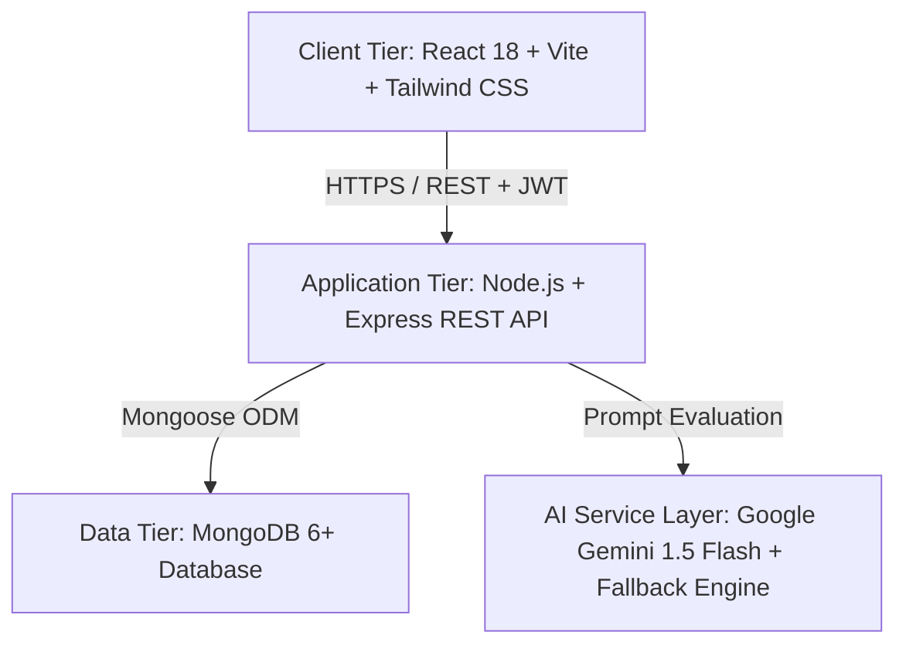

# CareerPilot AI – AI-Based Career and Placement Preparation Platform
## Final-Year B.Tech Computer Science and Design Capstone Project Report

---

### Executive Summary & Abstract
**CareerPilot AI** is an intelligent, full-stack career readiness and placement acceleration platform architected to bridge the critical gap between academic curriculum and high-growth industry expectations for engineering undergraduates. By unifying automated ATS (Applicant Tracking System) resume parsing, personalized career roadmap generation, algorithmic job-skill compatibility matching, an AI-powered mock interview simulator with multi-criteria critique, and a timed campus placement assessment suite, the platform delivers an end-to-end ecosystem for student placement success and administrative governance.

---

### 1. Introduction & Problem Statement
#### 1.1 Background
Campus placement drives at engineering institutions face recurring bottlenecks:
1. **Generic Resume Rejections**: Over 75% of fresher resumes are discarded by automated enterprise ATS systems before ever reaching human recruiters due to poor keyword alignment and inadequate formatting.
2. **Ambiguous Skill Progression**: Undergraduates struggle to determine which frameworks, architectural concepts, and data structures are demanded by modern engineering employers.
3. **Interview Anxiety and Lack of Constructive Feedback**: Students rarely have access to realistic technical or HR mock interviews that provide instant, actionable critique on technical depth and communication clarity.
4. **Disjointed Placement Preparation**: Students are forced to juggle disparate tools for resume building, DSA practice, aptitude testing, and job tracking with no unified tracking of overall placement readiness.

#### 1.2 Objectives
* Develop a production-grade MERN (MongoDB, Express.js, React, Node.js) web application with role-based access control (Student vs. Administrator).
* Implement multi-format resume ingestion (PDF, DOCX) with text extraction and Gemini-powered ATS scoring with automated heuristic fallbacks.
* Construct an algorithmic Skill Gap Matrix that compares student capabilities against target engineering roles.
* Create an interactive Mock Interview Simulator delivering real-time multi-criteria scoring across Relevance, Technical Accuracy, Clarity, Completeness, and Communication.
* Provide an aptitude and coding assessment module with timed tests, question palette navigation, and viva explanations.
* Deliver an administrative command center for real-time placement analytics, student status governance, and job posting curation.

---

### 2. System Architecture & High-Level Design
CareerPilot AI is designed according to a clean **Three-Tier Client-Server Architecture**:

#### 2.1 Architectural Highlights
1. **Stateless JWT Authentication**: Access tokens signed using HMAC SHA-256 containing user ID and role, allowing seamless horizontal scalability without server-side session stores.
2. **Graceful AI Degradation Architecture**: The AI Service layer dynamically detects the presence of `GEMINI_API_KEY`. If the external API quota is exceeded or offline, the platform automatically switches to a deterministic semantic heuristic engine returning identical JSON structures, ensuring 100% platform availability during academic evaluations.
3. **Real-time Database Aggregation**: Dashboard metrics and placement readiness indices are computed via native MongoDB aggregation pipelines and relational subdocument calculations, avoiding hardcoded mock data.

---

### 3. Software Requirements Specification (SRS)
#### 3.1 Functional Requirements (FR)
* **FR1 (Auth & RBAC)**: User registration with input sanitization, bcrypt password hashing (10 salt rounds), secure login, JWT issuance, password reset flow, and role-based route guards.
* **FR2 (Profile & Readiness Index)**: Editable student profile with dynamic profile completion tracking (0-100%) and Placement Readiness Index aggregation.
* **FR3 (Resume Parser & ATS Analyzer)**: Multer file uploads for `.pdf` and `.docx`, server-side text extraction via `pdf-parse` and `mammoth`, and ATS scoring categorized into Formatting, Keywords, Experience, and Skills.
* **FR4 (Dynamic Career Roadmap)**: Role-specific learning milestones with interactive completion toggles and recommended capstone projects.
* **FR5 (Job & Internship Portal)**: Placement listings with transparent skill matching percentages calculated as `(75% * Required Match) + (25% * Preferred Match)`, job bookmarking, and application tracking.
* **FR6 (AI Mock Interview System)**: Technical and HR interview rounds with live countdown clock, submission evaluation, 5-criteria radar score, and viva phrasing recommendations.
* **FR7 (Aptitude & Coding Practice)**: Timed assessments with categorized questions (Quantitative, Logical, Verbal, CS Core, Coding), question palette navigation, and instant solutions with viva explanations.
* **FR8 (Admin Console)**: High-level KPI monitoring, student activation/suspension toggles, and CRUD management for placement jobs and question banks.

#### 3.2 Non-Functional Requirements (NFR)
* **Security**: Helmet security headers, rate limiting (300 requests/15 minutes per IP), input validation via Zod, parameter pollution prevention, and sanitized database queries.
* **Performance**: Sub-200ms average response time for database queries enabled by indexes on foreign keys (`userId`, `jobId`, `category`, `isActive`).
* **Testability**: Automated test suite with over 80% statement and line coverage.

---

### 4. Technology Stack Justification
| Layer | Technology | Justification |
| :--- | :--- | :--- |
| **Frontend Framework** | React 18 + Vite | Component modularity, fast Hot Module Replacement (HMR), lightweight virtual DOM rendering. |
| **Styling & Design System** | Tailwind CSS | Modern utility-first responsive layout, dark/light theme support, accessible color contrasts. |
| **Backend Runtime** | Node.js (v20+) | Event-driven, non-blocking I/O model well-suited for high-concurrency RESTful APIs and asynchronous file processing. |
| **Web Server Framework** | Express.js | Mature middleware ecosystem (Helmet, Cors, Express-Rate-Limit, Multer). |
| **Database & ODM** | MongoDB + Mongoose | Schema flexibility for complex nested analytics (criteria scores, milestones, applications), native indexing, and aggregation pipelines. |
| **AI Integration** | Google Gemini 1.5 Flash | High-speed semantic text analysis, JSON mode instruction following, coupled with a robust rule-based heuristic fallback. |
| **Testing Framework** | Jest + Supertest | Comprehensive end-to-end integration and API unit testing with coverage reporting. |

---

### 5. Verification & Test Metrics
The CareerPilot AI backend was rigorously verified using Jest and Supertest against a dedicated test database (`careerpilot_ai_test`):

* **Total Test Suites**: 7 suites (`auth.test.js`, `profile_resume.test.js`, `resume_analysis_roadmap.test.js`, `jobs.test.js`, `interview.test.js`, `assessments.test.js`, `admin.test.js`)
* **Total Automated Tests**: 51 passed (100% pass rate)
* **Code Coverage**:
  * **Statements**: 83.60%
  * **Functions**: 89.18%
  * **Lines**: 84.41%

---

### 6. Conclusion & Future Scope
CareerPilot AI represents a comprehensive, production-ready capstone engineering project that demonstrates mastery across frontend architecture, backend RESTful API design, database modeling, secure authentication, and applied AI systems. Future enhancements planned include WebRTC-based video mock interviews with facial confidence detection, collaborative real-time code editor integration via WebSockets, and college ERP system integrations for automated placement drive notifications.
